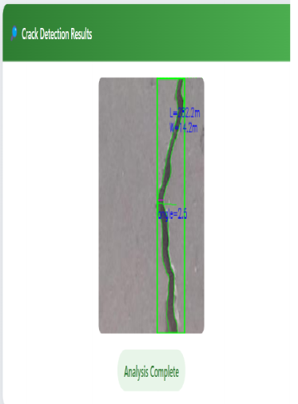

# Optimized CNN Model for Real-Time Concrete Crack Detection and Monitoring

This project presents a deep learning-based system for automated concrete crack detection using Convolutional Neural Networks (CNN). The proposed model is designed to identify cracks on concrete surfaces accurately and efficiently, helping improve infrastructure monitoring and reducing dependence on manual inspection methods. The system provides real-time crack analysis through a user-friendly web application.

---

## 🧠 Overview

Infrastructure such as bridges, highways, pavements, and buildings are prone to structural damage over time. Surface cracks are early indicators of structural deterioration and must be detected quickly to avoid severe failures.

This project focuses on:

- Automated crack detection using CNN models
- Real-time concrete surface monitoring
- Binary classification of cracked and non-cracked surfaces
- Deep learning-based feature extraction
- Web-based crack analysis system

The proposed CNN model uses convolutional layers, pooling layers, and fully connected layers to learn crack-related features from concrete surface images.

---

## 📁 Dataset

Dataset Link: https://www.kaggle.com/datasets/arunrk7/surface-crack-detection/data

The dataset contains concrete surface images categorized into:

- Crack
- Non-Crack

### Dataset Details:
- 40,000 concrete surface images
- 20,000 cracked images
- 20,000 non-cracked images
- Image size: 227 × 227 pixels
- RGB image format

The dataset includes diverse textures and lighting conditions to improve model generalization and robustness.

---

## 🛠️ Tools & Libraries

- Python
- TensorFlow / Keras
- Flask
- OpenCV
- NumPy
- Pandas
- Matplotlib
- Scikit-learn
- CNN (Convolutional Neural Network)

---

## 🔍 Image Preprocessing

The project performs several preprocessing operations before training:

- Image resizing
- Image normalization
- Data augmentation
- Noise reduction
- Feature extraction

Data augmentation techniques such as rotation, flipping, and scaling are used to improve model performance and generalization.

---

## 🧪 Model Training

### CNN Architecture Includes:
- Conv2D Layers
- MaxPooling Layers
- Flatten Layer
- Dense Layers
- Dropout Layer
- Sigmoid Output Layer

### Training Configuration:
- Optimizer: Adam
- Loss Function: Binary Crossentropy
- Epochs: 50
- Binary Classification (Crack / Non-Crack)

### Performance Metrics:
- Accuracy
- Precision
- Recall
- F1-Score
- Confusion Matrix

The dataset was divided into:
- 80% Training Data
- 20% Testing & Validation Data

---

## 📈 Results

The proposed CNN model achieved strong performance for crack detection.

| Model | Accuracy | Precision | Recall | F1 Score |
|-------|-----------|-----------|--------|----------|
| CNN | 97% | 82% | 80% | 81% |

The model effectively detects cracks under varying environmental and lighting conditions with high reliability.

---

## 🌐 Web Application

The project includes a web-based dashboard for real-time crack detection.

### Features:
- Upload concrete surface images
- Analyze crack presence automatically
- Display crack detection results
- Show original and processed images
- Real-time prediction system

The GUI provides a simple and efficient interface for infrastructure monitoring and automated inspection tasks.

---

## 🖼️ Sample Output



The system detects and highlights crack regions automatically using contour-based analysis and CNN prediction.

---

## 📂 Project Structure

```text
project/
│
├── backend/
│   ├── main.py
│
├── frontend/
│
├── static/
├── templates/
├── requirements.txt
└── README.md
```

---

## ▶️ How to Run the Project

### Run Backend

```bash
cd backend
python main.py
```

### Run Frontend

```bash
cd frontend
npm start
```

---

## 🚀 Future Enhancements

- Real-time drone-based crack monitoring
- Mobile application integration
- Edge device deployment
- Crack severity estimation
- Crack width and length measurement
- Transformer-based deep learning models
- Cloud-based infrastructure monitoring

Future improvements aim to enhance scalability, accuracy, and real-world deployment capabilities.

---

## 🎯 Applications

- Bridge Inspection
- Pavement Monitoring
- Building Safety Analysis
- Highway Maintenance
- Structural Health Monitoring
- Automated Infrastructure Inspection

---

## 📌 Conclusion

The proposed CNN-based crack detection system provides an accurate, efficient, and scalable solution for automated structural inspection. The model significantly reduces manual effort and improves crack detection consistency, making it suitable for real-world infrastructure monitoring applications.
